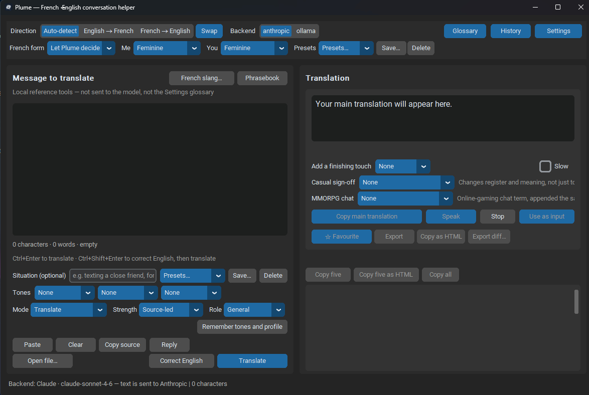
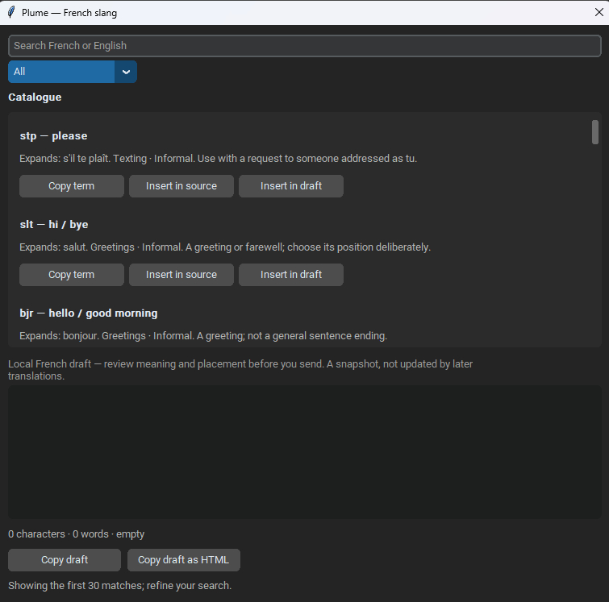

<div align="center">


# Plume

**French ↔ English conversation helper. Faithful. Private. Windows-native.**

A compact CustomTkinter desktop app: one faithful main translation plus five natural alternatives, each with a short English meaning check — built for real conversation, not lecture.

[](https://www.python.org/)
[](https://www.microsoft.com/windows)
[](https://customtkinter.tomschimansky.com/)
[](LICENSE)
[](https://github.com/hawkers63/Plume/actions/workflows/ci.yml)

**Conversation helper** · entry point `plume.py` · launcher `Plume.bat` · app icon `icon/icon-96.ico`

</div>

---

## Why Plume

Typing into a general chat box and hoping the French comes out right is slow and easy to send the wrong register. Plume keeps the **feel** of a careful bilingual exchange while the machine handles the bookkeeping: direction, form, gender agreement, placeholders, glossary, and copy helpers.

> **Not a game.** Plume is a conversation helper / translator. Some finishing touches (e.g. MMORPG chat slang) support gaming chat, but the product itself is not a game.

The hard rule underneath every release:

> **Faithful translation is sacred.** One primary rendering that preserves meaning, register, tone, punctuation and intent — it never adds facts, softens commitments, or invents context. Alternatives are genuinely distinct; finishing touches apply at copy time only and are never sent to the model.

| Pillar | What you get |
| --- | --- |
| **Faithfulness** | Main + five alternatives with English meaning checks; no silent rewriting |
| **Conversation craft** | tu/vous, Me/You gender agreement, situations, tones, writing profile, presets |
| **Privacy-aware** | Claude (cloud) or Ollama (local); opt-in history; keys masked; no phrase logging |
| **Windows-native** | Dark CustomTkinter UI, British English throughout, optional tray / exe |

---

## Key features

| | |
| --- | --- |
| **Auto-detect or force direction** | English → French / French → English, or let Plume detect |
| **Main + five alternatives** | Distinct word choice / idiom / order; each with an English meaning check |
| **tu / vous & gender agreement** | Consistency indicator; separate Me / You (Feminine · Masculine · Avoid) |
| **Placeholders, Keep as-is, Glossary** | Names/links/markers survive; preferred renderings stay consistent |
| **Copy helpers** | Copy main · Use this · Use as input · Copy five · Copy all · Copy as HTML |
| **Finishing touches (copy-time only)** | Emotes, casual sign-offs, MMORPG chat terms — never sent to the model |
| **French slang… & Phrasebook** | Local reference insert / draft; phrasebook, optionally saved as a named book |
| **Situations, tones, presets** | Built-in and saved situations; register tones; conversation presets; writing profile |
| **History & export** | Optional local favourites, search, Anki/Markdown export, study sheet / diff |
| **Speak / Correct English** | Optional ElevenLabs Speak + Speak source (Stop / Normal·0.8×·0.75×); Correct English then translate |
| **Backends** | Claude (cloud) or Ollama (local); optional Claude→Ollama fallback |
| **One-click launch** | `Plume.bat`, or `python plume.py` / `py -3 plume.py` |
| **Optional exe** | `pyinstaller plume.spec` (Windows app icon: `icon/icon-96.ico`) |

Full capability detail lives in **What it does** below and in [`ROADMAP.md`](ROADMAP.md).

---

## Glimpse

Real CustomTkinter captures from a Windows session. More shots (Settings, Glossary, History) can join later under [`docs/screenshots/`](docs/screenshots/).

<div align="center">
  
  
</div>

<p align="center"><em>Main window · French slang…</em></p>

---

## Quick start

**Prerequisites:** Windows 11 · **Python 3.10+** · one backend (Claude API key **or** a running Ollama model)

```powershell
cd C:\Plume
pip install -r requirements.txt
python plume.py
```

Or double-click **`Plume.bat`**. Optional frozen build (embeds `icon/icon-96.ico` as the Windows app icon):

```powershell
pip install pyinstaller
pyinstaller plume.spec
```

That installs `customtkinter>=5.2.0`. Optionally `pip install pystray Pillow` for tray / sign-in autostart / close-to-tray.

On first use of Claude, Plume shows a one-time privacy notice. Open **Settings** to enter your key or switch to Ollama.

### Usage

1. Launch with `python plume.py`, `py -3 plume.py`, or `Plume.bat`.
2. Type or paste a phrase; set direction, form, situation and tones as needed.
3. **Ctrl+Enter** to translate; **Ctrl+Shift+Enter** to Correct English then translate.
4. Copy main or promote an alternative with **Use this**; optional finishing touches apply at copy time only.
5. Open **History**, **Glossary**, **French slang…**, or **Settings** when needed.

---

## Project layout

| Path | Role |
| --- | --- |
| `plume.py` | Entry point and application |
| `Plume.bat` | Convenient Windows source launcher |
| `tests/` | Headless unit tests (`unittest`) |
| `plume.spec` | Optional PyInstaller build (uses `icon/icon-96.ico`) |
| `requirements.txt` | Runtime dependency (`customtkinter`) |
| `icon/icon-96.png` | README / UI-friendly icon (GitHub renders PNG) |
| `icon/icon-96.ico` | Windows app icon (exe, shortcuts, tray asset) |
| `plume_config.example.json` | Shape of local settings (do not commit live keys) |
| `docs/screenshots/` | README media (real UI captures + optional placeholders) |
| `.github/` | Issue / PR templates, Dependabot, Release Drafter config |
| `ROADMAP.md` | Product roadmap by version |
| `CONTRIBUTING.md` | Private team working agreements |
| `AGENTS.md` | Agent / steward notes |
| `LICENSE` / `COPYRIGHT` | Proprietary All Rights Reserved |

### Configuration & data (do not commit secrets)

| Path / setting | Purpose | Tracked in Git? |
| --- | --- | --- |
| `plume_config.json` | Live settings (may hold API keys) | No (gitignored) |
| `plume_history.json` | Optional local history | No |
| `%LOCALAPPDATA%\Plume` | Frozen-exe config directory | No |
| `notes/` | Design and concept notes | Yes (selective) |

---

## What it does

- **Auto-detect** the input language, or force **English → French** /
  **French → English** for short or ambiguous phrases (`non`, `merci`, names,
  quotations, mixed-language messages).
- One primary translation that preserves meaning, register, tone, punctuation
  and intent — it never adds facts, softens commitments, or invents context.
- Five genuinely distinct alternatives (different word choice, idiom or word
  order — not punctuation-only variants), each with its English meaning check.
- **tu / vous** consistency and a language-confidence indicator.
- **French gender agreement** for both people in the conversation: separate
  **Me** (speaker) and **You** (addressee) controls on the toolbar, each
  *Feminine* / *Masculine* / *Avoid where possible*. Woman-to-woman chat is the
  default (Feminine / Feminine); explicit gender in the source always wins, and
  French → English never invents gender in the English.
- Placeholder protection for names, links, dates and `[Name]` / `{amount}`
  style markers, so they survive translation unchanged. A **Keep as-is** list
  in Settings extends this to your own names or terms (up to 20, 40
  characters each), matched longest-first so e.g. "Marie-Claire" is not
  swallowed by "Marie".
- A **Glossary** (up to 20 pairs) for terms that *should* be translated,
  just consistently — e.g. always "délai" for "deadline", or a
  community/gaming term like Auridon ↔ Auridia — unlike Keep as-is,
  which never translates a term at all. A background-only prompt hint,
  same as tones/situation: the source text still wins, and preferred
  renderings adapt grammatically (French elisions included) rather than
  being forced verbatim. Editable either in Settings (one pair per line)
  or via the toolbar's **Glossary** button, a dedicated window with
  search, Add/Edit/Delete and a live preview — both edit the same list.
  **Add to glossary…** and **Keep as-is**, beneath the five alternatives,
  promote a name straight from a just-seen result — pre-filled from your
  input selection and the working translation where they're short enough
  to be one term — without re-typing anything into Settings by hand. The
  Glossary window's **"Also save the reverse pair"** checkbox (ticked by
  default for a name-shaped pair like Auridon/Auridia) writes both
  directions from one Add, so a gaming/community term only needs typing
  once.
- A local **fidelity check** runs on every result, with no extra API
  call: if a number, date, web address or a Keep-as-is term from the
  source doesn't turn up in any translation or alternative, a tentative
  advisory note says so (never a verdict that the translation is wrong)
  — useful for catching a dropped detail the model's own notes stayed
  silent about. The same check flags a Glossary preferred rendering that
  never shows up (elided forms like "d'Auridia" count as present).
- A copy button on every result, with a prominent **Copy main translation**;
  alternatives can be promoted with **Use this**, and the current result can
  be re-sent as new input with **Use as input**.
- Three optional, independent **finishing touches** appended only at copy
  time — never sent to the model, so the translation itself stays faithful:
  a 14-term **Emotes & Reactions** picker (`:)` `:p` `;)` `xD` `mdr` `ptdr`
  `jpp` `:D` `:/` `:'(` `:o` `^^` `<3` `xo`), an 11-term **Casual sign-off**
  picker (`tkt`, `grave`, `dsl`, `bof`, `nickel`, `tranquille`, `carrément`,
  `biz`, `a+`, `merci`, `trop bien`) labelled as changing register and
  meaning, not just tone, and a 20-term **MMORPG chat** picker (`dispo`,
  `rez`, `bj`, `osef`, `oklm`, `aïe`, `gg`, `gl`, `hf`, `afk`, `brb`, `sec`,
  `lag`, `gj`, `go`, `gn`, `cya`, `cyl`, `ttyl`, `ttys`) for online-gaming
  chat. Both slang pickers show an English gloss in brackets (e.g. "tkt
  (don't worry)") — only the term itself is ever appended, never the gloss.
- A **French slang…** reference window: search a local, curated catalogue
  of French terms and phrases (bilingual, accent/case-insensitive) by
  category, insert one straight into the message at your caret, copy just
  the raw French, or build a separate, freely editable **local draft**
  (with its own reading-time metrics and plain/HTML copy) for a
  translation whose subtleties don't fit a one-click picker — e.g. `bof`
  conveying indifference rather than a flat "terrible", or `bonsoir`
  greeting or parting depending on context. Nothing here is sent to the
  model or changes the translation itself.
- A **Texting** chip strip under the message box (v1.61): one tap each
  for `stp`, `rdv`, `cad`, `bcp`, `pcq`, `pk` — the most common texting
  shorthand — inserted at the caret the same way French slang… does,
  without opening that dialog. These are in-sentence abbreviations, not
  copy-time suffixes (a suffix of "rdv" would read "On se voit demain
  rdv", which is wrong), so they're deliberately separate from the
  Casual sign-off picker's `tkt`/`dsl`/`a+`.
- A **Phrasebook** button beside French slang…: a second, free-form local
  reference — your own source → note pairs, added as you go, **Insert**ed
  into the message at the caret or **Delete**d. Capped at 30 entries (80
  characters each way); a duplicate phrase is refused rather than added
  twice. The working list is ephemeral by design (cleared on Clear) and
  never sent to the model, but it can optionally be named and saved —
  **Save as…**/**Update**/**Load**/**Delete book**, up to 8 books — so a
  phrasebook you use often (e.g. a guild's callouts) survives Clear and a
  restart in `plume_config.json`, still never sent to the model.
- **Copy source** and **Situation presets** (Close friend, Formal work
  email, Neighbour, Appointment, Dating/chat) for faster back-and-forth,
  plus up to 12 of your own **saved situations** (Save…/Delete beside the
  menu) for a shortcut the built-in list doesn't cover, e.g. "Guild raid
  chat" or "School gate".
- **Open file…** imports a `.txt` or `.md` file (up to 2 MiB, UTF-8 or
  UTF-16) straight into the input box, asking before it replaces anything
  already there. Three more crash-safe ways in, none of them native
  Explorer drag-and-drop: `--import "path"` on the command line, an
  optional "Send to Plume" entry in Explorer's right-click menu (off by
  default, in Settings), and pasting a clipboard value that is itself a
  `.txt`/`.md` file path, which offers to open the file rather than
  inserting the path as text. No Word import either — a plain file
  picker was the safer, dependency-free choice for this app's Tcl/Tk
  build (see `ROADMAP.md`'s v1.18/v1.28/v1.32 entries).
- Optional local history with favourites — including a one-click
  **☆ Favourite** on the main panel — per-entry **Copy** / **Reopen** /
  **Delete**, a **search box** (source text, translation and situation),
  "clear history" preserving favourited entries, and **Export
  favourites** to an Anki TSV deck or Markdown study sheet.
- Optional ElevenLabs **Speak** buttons for pronunciation help, with a
  **Stop** button and a speech-rate menu — **Normal / 0.8× / 0.75×**,
  persisted across restarts — instead of a plain Slow toggle (a slower,
  lower-pitched playback rate — not studio-quality time-stretching, but
  a genuine aid for catching liaisons and elisions). **Speak source**
  sits beside **Copy source** so you can hear the *other* person's
  original French at your chosen rate without copying it into the input
  or swapping direction.
- **Correct English** (Ctrl+Shift+Enter) fixes spelling, grammar and
  necessary punctuation in a quickly-typed English draft — never
  paraphrasing, translating or changing register — then automatically
  translates the corrected text into French, so typos are never
  faithfully carried into the French output.
- Optional **sign-in autostart** and a **system tray icon** (needs
  `pystray` and `Pillow`): launch quietly at Windows sign-in, start
  minimised, and close-to-tray instead of quitting — a conversation
  helper that doesn't need to be relaunched and re-parked every session.
  The tray menu's **Show and paste clipboard** brings the window back
  and pastes what's on the clipboard in one click — it never translates
  automatically. While the window is minimised to the tray, a finished
  translation shows a plain "Translation ready." (or "…failed.") balloon
  — never the source text — so a request doesn't finish silently out of
  sight.
- Optional **restore hotkey** (Windows only, off by default in
  Settings): Ctrl+Shift+P brings a buried window back — deiconify, lift,
  focus — without pasting or translating anything. Runs on its own
  message-only window, never a subclass of the main Tk window, so it
  cannot crash the interpreter the way a foreign message on the main
  window once did (see ROADMAP v1.18/v1.50). If the chord is already
  claimed by another application, the checkbox turns itself back off
  with a one-line explanation rather than silently doing nothing.
- **Quick translate** (v1.60): **Ctrl+Shift+T** always works while Plume
  is focused — no Settings needed. An opt-in system-wide chord (same
  checkbox area, off by default) works from anywhere: it pastes the
  clipboard as the new source, runs the current Mode's translation, and
  copies the accepted result — one chord instead of switch-paste-
  translate-copy. Skips a file path (offers to open it, like Paste,
  rather than translating the path text) and never auto-copies a result
  for a message you've since typed past. Uses its own isolated
  message-only window, the identical safe mechanism the restore hotkey
  already used, extended to support a second independent chord.
- **Conversation presets:** save the toolbar's direction, French form,
  Me/You gender agreement, situation and tones as a named preset (a
  "Presets…" menu plus Save/Delete beside the toolbar's You control) —
  switch between a few regular conversations in one click. A save is
  refused outright (with an explanation) on a duplicate name or past the
  12-preset cap, rather than silently discarding anything.
- **Register tones:** up to three background tones (Warm, Terse,
  Playful, Precise, Courteous, Direct, Reassuring) beneath Situation,
  the same non-authoritative background context, never overriding the
  source text's own meaning. Conflicting tones (e.g. Terse + Playful)
  resolve automatically, keeping whichever one you just chose.
- **Writing profile** (Mode / Strength / Role), beneath Tones: an
  optional second layer on top of presets. Strength (Source-led / Light /
  Balanced) and Role (General / Friend / Colleague / Customer) add a
  background register/relationship hint only once Strength is raised
  above Source-led — never assuming an identity or authority the source
  text doesn't establish. Mode (Translate / Correct English then
  translate) changes which pipeline Translate/Ctrl+Enter runs, but only
  on an explicit click — selecting a Mode, or applying a preset that
  restores one, never itself starts a request. Saved on conversation
  presets alongside direction, form, tones and situation.
- **Remember tones and profile**, beneath Writing profile: a one-click
  way to make your current Tones and Mode/Strength/Role the defaults a
  future launch starts with, instead of resetting to None/Translate/
  Source-led/General every time. Applying a conversation preset still
  overrides these menus without changing what Remember last saved.
- **Export** the current result to a Markdown study sheet (source,
  situation, all alternatives, a diff view), **Export diff…** for a
  standalone textual source/translation comparison, and **Copy as HTML**
  (Windows) for pasting formatted text into email or documents — all
  next to Favourite on the primary card. All three (plus Favourite) use
  the exact text that produced the on-screen result, even if you've since
  edited the input box.
- The input pane shows a reading-time estimate alongside the character
  and word count, and the **translation result** shows the same estimate
  under the main card, always describing what Copy main translation
  would actually copy.
- **Copy five** and **Copy five as HTML**, above the alternatives list:
  numbered plain text of the five alternative translations only — no
  meaning checks, no finishing touch.
- **Copy all**, beside Copy five: the whole translation package in one
  clipboard write (plain text and, on Windows, HTML) — source, situation,
  language line, the main translation and all five alternatives with
  their meaning checks — for pasting the full exchange into an email,
  note or document in one click instead of copying each piece separately.
- Optional **French punctuation on copy** (Settings, off by default):
  when the working result is French, Copy main translation/Copy five/
  Copy as HTML/Copy all apply narrow no-break spaces before `; : ! ?`, turn
  `"..."` into `…`, and turn short "straight-quoted phrases" into
  guillemets. Copy-time only — the on-screen result, the exported study
  sheet/diff and Speak are never affected.
- **Lowercase translations** checkbox under the alternatives: lowercases
  the displayed and copied translation text (accents kept, `ß` never
  expanded to `ss`), off by default and remembered across restarts.
  Display/chat copies only — Export, Export diff, Favourite, History
  and "Use as input" always keep the original casing.

Keyboard and mouse highlights:

- **Ctrl+Enter** — translate the current input.
- **Ctrl+Shift+Enter** — correct the input's English, then translate it
  (disabled for a fixed French → English direction).
- **Paste** / **Clear** buttons, plus per-row **Use this**, **Copy** and
  **Speak**. **Undo Clear** (or Ctrl+Shift+Z) reverses the last Clear —
  input, result, phrasebook and reply-thread all come back — one level,
  in memory only, so a mis-click doesn't cost a re-typed message or
  another backend call.
- Use **Swap** to reverse a fixed direction before translating if
  auto-detection guesses wrong.
- **Reply** copies the main translation, swaps direction and clears the
  input in one click, ready for the incoming message — the previous
  result stays visible for reference. Situation is left untouched, since
  it describes the scene, not the last message. Reply also remembers
  that turn as background context ("Thread on") so a short incoming
  reply like "Oui, vers 19h" resolves against what was just discussed —
  one pair, in memory only, never persisted, ended by Clear or "Use as
  input", and never able to override what the new source text says.
- After translating an incoming French message, the same button becomes
  **"Reply to this"**: it does not copy the English onto the clipboard
  (you are not sending English), pins direction to English → French even
  from Auto-detect (so a short English draft can't bounce back into
  French), and still remembers the turn for "Thread on". Situation is
  never touched either way.
- Open **History** to revisit, favourite, copy, delete or reopen saved local
  translations when history is enabled.

---

## Backends

### Claude (cloud)

Uses the Messages endpoint at `https://api.anthropic.com/v1/messages` with the
`x-api-key`, `anthropic-version` and `content-type` headers. The default model
is `claude-sonnet-4-6`; you can change it in Settings (for example to
`claude-sonnet-5`). The key is read from the config file if you deliberately
enter it, otherwise from the `ANTHROPIC_API_KEY` environment variable.

Transient failures (rate limiting, a temporary 502/503/504, or a dropped
connection) are retried automatically with a short exponential backoff
before Plume shows an error — no action needed, and nothing is retried
for a rejected key, a missing model, or a certificate/TLS failure. The
status bar shows retry progress ("Retrying (2 of 4)…") so a 429 doesn't
look like a hang; ElevenLabs Speak retries the same way. Clear, closing
the window, or starting a new translation stops an abandoned request
from retrying or being delivered late.

Optional: **"If Claude is unavailable, retry once with local Ollama"**
(Settings, off by default) tries Ollama a single time after Claude
exhausts its retries, if a local model is configured — never the other
way round. A short advisory says so on the result when it happens.

### Ollama (local, privacy-first)

Talks to `http://localhost:11434` using `/api/chat` with `stream: false` and
`format: "json"`. The Settings **Detect** button lists locally installed models
via `/api/tags`.

> **Note on local quality.** Local models vary a lot in French quality and in
> reliable JSON compliance. Plume validates strictly: if a local result fails
> validation it shows a retryable error rather than displaying fewer than five
> options or made-up fields. A capable multilingual model is recommended.

---

## Privacy

- **Claude** processes text in the cloud: what you submit is sent to Anthropic.
- **Ollama** keeps everything on this machine, subject to your own Ollama setup.
- **ElevenLabs Speak** sends only the selected text to ElevenLabs when you use
  a Speak button and have configured an ElevenLabs key.
- API keys are stored only if you deliberately enter them; otherwise Plume
  prefers `ANTHROPIC_API_KEY` for Claude. Settings shows stored keys **masked**.
- Plume does **not** log source messages, translated messages, headers or keys.
- Local history is **off** by default. When enabled, it is stored only on this
  device in `plume_history.json`.
- The status line, window title and error messages never contain your phrase.

---

## Configuration

Settings are saved to `plume_config.json` (generated from defaults on first
save). See `plume_config.example.json` for the shape. Do **not** commit your
live file — it may contain an API key.

- Running **from source**: the file sits beside `plume.py`.
- Running the **frozen executable**: it is written to `%LOCALAPPDATA%\Plume`,
  not the temporary extraction folder.

Saving is atomic (temp file → flush → replace). If an existing file is damaged,
an automatic save will **refuse to overwrite it**; use the Settings window's
recovery prompt to replace it deliberately.

Settings also controls placeholder protection (including the Keep as-is
term list), local history, maximum message length, optional ElevenLabs voice
configuration, and whether Plume stays on top of other windows. An **About**
panel at the top of Settings shows the app name, current version and the
copyright notice.

---

## Building a Windows executable (optional)

```powershell
pip install pyinstaller
pyinstaller plume.spec
```

This produces `dist\Plume.exe`, bundling the CustomTkinter assets and both
icons (`icon/icon-96.ico` as the Windows application icon; `icon/icon-96.png`
alongside for shortcuts / tray). Confirm on a real Windows profile that
configuration is written to `%LOCALAPPDATA%\Plume`.

---

## Tests

The deterministic logic (config safety, placeholder round trips, prompt
construction, the full response contract, privacy of diagnostics and the
stale-request guard) is covered by unit tests that run headless:

```powershell
python -m unittest discover -s tests -v
```

---

## Troubleshooting

| Symptom | Likely cause / fix |
|---|---|
| "No Claude API key is set" | Enter a key in Settings, or set `ANTHROPIC_API_KEY`. |
| "The Claude API rejected the request" | Wrong or expired key — check Settings. |
| "The requested model was not found" | Fix the model name in Settings. |
| "Could not reach Ollama … Is it running?" | Start the Ollama app; try **Detect**. |
| "No ElevenLabs API key is set" | Add an ElevenLabs key in Settings before using **Speak**. |
| "did not contain exactly five alternatives" | A model slip — press Translate again, or switch backend. |
| Result shows "Generated for an earlier message" | You edited the input while a translation was in flight; the result is kept but flagged. |

---

## Version-1 limitations (deliberately deferred)

- No speech input, messaging-service integration or live voice agent.
- No cloud sync; local history remains device-only and opt-in.
- French ↔ English only; other language pairs come later.
- Only *Neutral international French*; regional presets (France, Belgium,
  Quebec) come after native-speaker review.
- No dictionary-style word-by-word analysis — Plume is for fast conversation.

---

## Roadmap, contributing & licence

- Product roadmap: [`ROADMAP.md`](ROADMAP.md)
- How we test and open PRs: [`CONTRIBUTING.md`](CONTRIBUTING.md)
- Agent / steward notes: [`AGENTS.md`](AGENTS.md)
- Licence terms: [`LICENSE`](LICENSE)
- Copyright notice: [`COPYRIGHT`](COPYRIGHT)

---

*Plume — “feather” / “quill”. Built to help you chat, not to lecture you.*

---

## Copyright

Copyright (c) 2026 Mark Hawksworth. All rights reserved.

Plume may not be copied, modified, redistributed or used as the basis of
another product without Mark Hawksworth's express written permission.
See [`LICENSE`](LICENSE) and [`COPYRIGHT`](COPYRIGHT). Canonical repository:
https://github.com/hawkers63/Plume
